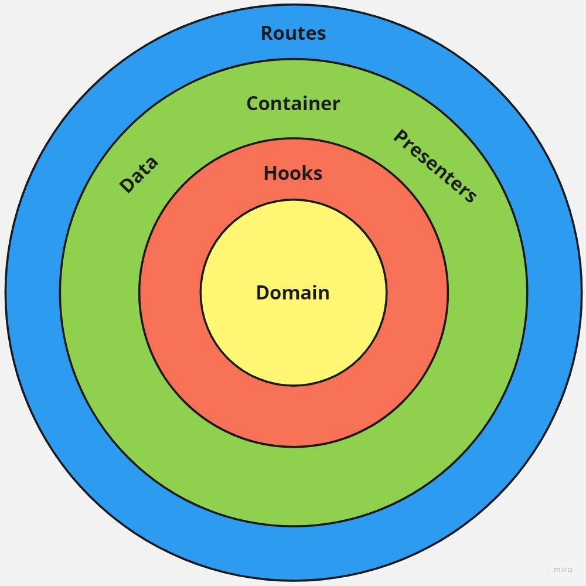
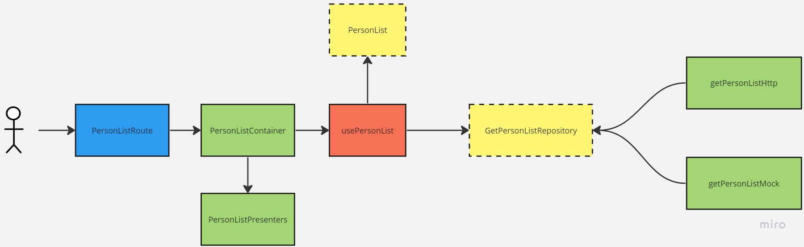

# React Dependency Injection

## Camadas de Arquitetura

O projeto é organizado em quatro camadas distintas:

### Camada Domain

A camada Domain é responsável por definir os objetos de domínio do aplicativo.
Aqui são encontradas as entidades centrais, interfaces de repositório e lógica
fundamental que reflete as regras de negócios do sistema.

### Camada Application

A camada Application assume a responsabilidade de implementar a lógica de
negócios do aplicativo. Ela utiliza os objetos de domínio definidos na camada
Domain para criar os casos de uso e interações que representam a funcionalidade
central do aplicativo.

### Camada Infrastructure

A camada Infrastructure desempenha um papel crucial na orquestração do
aplicativo. Aqui, a lógica de negócios da camada Application é combinada com
serviços do mundo real, como APIs e armazenamentos. Além disso, a camada
Infrastructure converte os objetos de domínio em objetos compreensíveis para as
fontes de dados e vice-versa.

### Camada Routing

A camada Routing lida com a navegação e roteamento do usuário. É responsável por
encaminhar as solicitações do usuário para os controladores apropriados nas
outras camadas, iniciando assim o fluxo de funcionalidades do aplicativo.

## Estrutura de Pastas

A estrutura de pastas adotada no projeto é projetada para refletir a organização
das diferentes camadas da arquitetura. Isso promove a clareza e facilita a
localização de diferentes partes do código.

- **Domain**: Nesta pasta, estão definidos os objetos de domínio, como entidades
  e interfaces de repositório.

- **Hooks**: A pasta Hooks é onde a lógica de negócios é implementada. Ela
  utiliza a camada Data para buscar dados de fontes externas, como APIs ou
  armazenamentos, e cria os casos de uso necessários para a camada Application.

- **Data**: A camada Data é responsável pela integração com serviços externos,
  como APIs e armazenamentos. Ela também realiza a conversão entre os objetos de
  domínio e os formatos de dados exigidos pelas fontes externas.

- **Container**: A pasta Container é responsável por orquestrar as regras de
  negócios e a lógica dos apresentadores. Ela utiliza os Hooks da camada
  Application e fornece as dependências necessárias para os controladores.

- **Presenters**: Nesta pasta, estão os componentes de interface do usuário
  (UI). Eles são focados exclusivamente na apresentação visual e não contêm
  lógica de negócios.

- **Routes**: A pasta Routes atua como o ponto de entrada da aplicação. Ela
  chama os containers apropriados para as rotas definidas, dando início ao fluxo
  de funcionalidades.

<pre>
├── src
│   ├── api
│   ├── components
│   ├── commons
│   ├── features
│   │   ├── feat1
│   │   │   ├── container
│   │   │   ├── data
│   │   │   ├── domain
│   │   │   ├── hooks
│   │   │   └── presenters
│   │   ├── feat2
│   │   ├── ...
│   ├── routes
├── public
│   ├── index.html
│   └── manifest, etc.
└── config.files
</pre>

## Architecture

## Adicionais

- Roteamento sem trocar de rotas
- TS e JS no mesmo projeto
- TS Config + Organizador de imports
- Skeleton Loader
